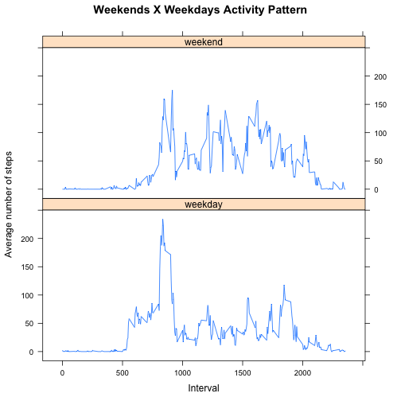

# Reproducible Research: Peer Assessment 1

****
## Loading and preprocessing the data

```r
data <- read.csv("activity.csv")
data$date <- as.Date(data$date)  ## convert character *date* to *date object*
str(data)
```

```
## 'data.frame':	17568 obs. of  3 variables:
##  $ steps   : int  NA NA NA NA NA NA NA NA NA NA ...
##  $ date    : Date, format: "2012-10-01" "2012-10-01" ...
##  $ interval: int  0 5 10 15 20 25 30 35 40 45 ...
```

```r
summary(data)
```

```
##      steps            date               interval   
##  Min.   :  0.0   Min.   :2012-10-01   Min.   :   0  
##  1st Qu.:  0.0   1st Qu.:2012-10-16   1st Qu.: 589  
##  Median :  0.0   Median :2012-10-31   Median :1178  
##  Mean   : 37.4   Mean   :2012-10-31   Mean   :1178  
##  3rd Qu.: 12.0   3rd Qu.:2012-11-15   3rd Qu.:1766  
##  Max.   :806.0   Max.   :2012-11-30   Max.   :2355  
##  NA's   :2304
```

****
## What is mean total number of steps taken per day?

```r
### tapply used to return a vector with the sum of steps for each day (the
### dimension names are the dates)
totalStepsByDay <- tapply(data$steps, data$date, sum)
totalStepsByDayMean <- mean(totalStepsByDay, na.rm = TRUE)
totalStepsByDayMedian <- median(totalStepsByDay, na.rm = TRUE)
hist(totalStepsByDay, main = "Total Steps By Day", xlab = "total steps by day")
abline(v = totalStepsByDayMean, col = "blue", lwd = 2, lty = "dashed")
abline(v = totalStepsByDayMedian, col = "yellow", lwd = 2, lty = "dashed")
```

 


### Total steps mean  : 

```r
mean(totalStepsByDay, na.rm = TRUE)
```

```
## [1] 10766
```

### Total steps median: 

```r
median(totalStepsByDay, na.rm = TRUE)
```

```
## [1] 10765
```


****
## What is the average daily activity pattern?
### 1. Time series plot of average daily activity pattern

```r
## tapply used to return a vector with the mean of steps for each interval,
## accross all dates (the dimension names are the intervals)
avgStepsByInterval <- tapply(data$steps, data$interval, mean, na.rm = TRUE)
plot(names(avgStepsByInterval), avgStepsByInterval, type = "l", main = "Average Daily Activity Pattern", 
    ylab = "Average Number Of Steps", xlab = "Intervals")
```

 

### 2. Which 5-minute interval, on average across all the days in the dataset, contains the maximum number of steps?

```r
## the function 'which.max' returns the index in the vector where the maximum
## number of averaged steps are found in the vector, and the 'names' function
## return the named interval.
```

### Interval with maximum average of steps: 

```r
names(which.max(avgStepsByInterval))
```

```
## [1] "835"
```


****
## Imputing missing values
### 1. Total number of missing values in dataset
Although there are only missing values in the "steps" column, I used the 
*complete.cases* function because they required **missing values in dataset** and not in a specific column

```r
data2 <- data  ## create a new data frame to work the missing values
indexMissingValuesInData <- complete.cases(data)  ## index the complete cases
## used the function table to calculate missing and non missing values, but
## printed only the number for missing as required
```

### Total of rows with missing values: 

```r
table(indexMissingValuesInData)["FALSE"]
```

```
## FALSE 
##  2304
```


### 2. Filling in all of the missing values in the dataset
The strategy used to fill the missing values is substitute de NAs with then 
*mean* of each interval accross all days, reusing the vector 
*avgStepsByInterval* created in a previous section of the assignment.
The code for this strategy is in the next section.
### 3. Create a new dataset ...

```r
## print summary of original dataset
summary(data)
```

```
##      steps            date               interval   
##  Min.   :  0.0   Min.   :2012-10-01   Min.   :   0  
##  1st Qu.:  0.0   1st Qu.:2012-10-16   1st Qu.: 589  
##  Median :  0.0   Median :2012-10-31   Median :1178  
##  Mean   : 37.4   Mean   :2012-10-31   Mean   :1178  
##  3rd Qu.: 12.0   3rd Qu.:2012-11-15   3rd Qu.:1766  
##  Max.   :806.0   Max.   :2012-11-30   Max.   :2355  
##  NA's   :2304
```

```r
## create new column in data frame to indicate where information is missing
## or not. 'TRUE' indicates a missing value, 'FALSE' indicates the opposite
data2$missing <- !indexMissingValuesInData  ## 'not' to preserve meaning
## below is a for loop to fill the missing values with the mean of each
## interval accross all days
for (i in 1:nrow(data2)) {
    if (data2[i, "missing"]) {
        data2[i, "steps"] <- avgStepsByInterval[as.character(data2[i, "interval"])]
    }
}
## print summary of new dataset with missing values filled
summary(data2)
```

```
##      steps            date               interval     missing       
##  Min.   :  0.0   Min.   :2012-10-01   Min.   :   0   Mode :logical  
##  1st Qu.:  0.0   1st Qu.:2012-10-16   1st Qu.: 589   FALSE:15264    
##  Median :  0.0   Median :2012-10-31   Median :1178   TRUE :2304     
##  Mean   : 37.4   Mean   :2012-10-31   Mean   :1178   NA's :0        
##  3rd Qu.: 27.0   3rd Qu.:2012-11-15   3rd Qu.:1766                  
##  Max.   :806.0   Max.   :2012-11-30   Max.   :2355
```

### 4. Make a histogram of the total number of steps taken each day after imputation of missing values

```r
### tapply used to return a vector with the sum of steps for each day (the
### dimension names are the dates)
totalStepsByDayData2 <- tapply(data2$steps, data2$date, sum)
hist(totalStepsByDayData2, main = "Total Steps By Day (imputing NAs)", xlab = "total steps by day")
```

 

### Total steps mean (imputing NAs):

```r
mean(totalStepsByDayData2)
```

```
## [1] 10766
```

### Total steps median (imputing NAs):

```r
median(totalStepsByDayData2)
```

```
## [1] 10766
```

### Difference and impact
The *mean* and *median* values differ from the ones obtained in the first part of the assignment, but only slightly. The real impact was in the frequency of steps in the histogram.

****
## Are there differences in activity patterns between weekdays and weekends?
### 1. Create a new factor variable in the dataset with two levels -- "weekday" and "weekend" indicating whether a given date is a weekday or weekend day.

```r
data3 <- data
week <- c("weekend", rep("weekday", 5), "weekend")  ## vector to provide factors
## define function to calculate weekday/weekend
weekfun <- function(x) {
    ## add 1 to wday (0-6 range) to make it compatible with vector range (1-7)
    week[as.POSIXlt(x)$wday + 1]
}
## use *sapply* to apply previous function to all dates
data3$week <- sapply(data3$date, weekfun, USE.NAMES = FALSE)
data3$week <- factor(data3$week)  ## transform into factors
str(data3)  ## show that the new data frame has a factor weekday|weekend
```

```
## 'data.frame':	17568 obs. of  4 variables:
##  $ steps   : int  NA NA NA NA NA NA NA NA NA NA ...
##  $ date    : Date, format: "2012-10-01" "2012-10-01" ...
##  $ interval: int  0 5 10 15 20 25 30 35 40 45 ...
##  $ week    : Factor w/ 2 levels "weekday","weekend": 1 1 1 1 1 1 1 1 1 1 ...
```

```r
## create data frame to hold average of steps by interval by week
data4 <- aggregate(steps ~ week + interval, data = data3, FUN = mean)
```

### 2. Panel plot comparing weekends and weekdays activity pattern

```r
library(lattice)
xyplot(steps ~ interval | week, data4, type = "l", layout = c(1, 2), main = "Weekends X Weekdays Activity Pattern", 
    ylab = "Average number of steps", xlab = "Interval")
```

 

